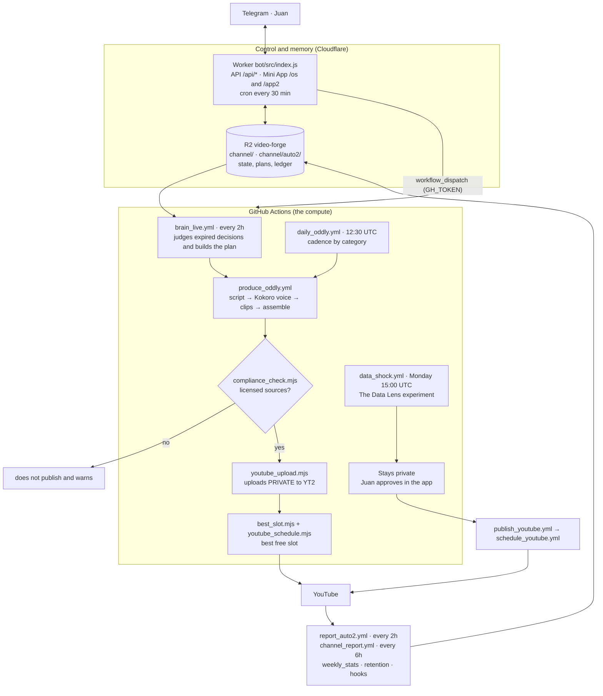

# video-forge

A YouTube video factory that runs itself in the cloud: it writes the script, narrates, renders, uploads and schedules, for two independent channels.

[](https://github.com/juanberrio0399/video-forge/actions/workflows/tests.yml)
[](https://github.com)
[](https://github.com)
[](LICENSE)

## What it is and what problem it solves

Publishing on YouTube with cadence takes a team (script, voice, editing, SEO, scheduling) or a
monthly subscription to rendering tools. This repo does that work with infrastructure that
costs nothing: **GitHub Actions is the CPU, a Cloudflare Worker + R2 are the control and memory, and
Telegram is the interface**. Nothing renders on a PC and there is no server to maintain.

The system doesn't just produce: **it measures what it publishes and decides what to produce next**. Every piece is
recorded as a decision with its metric and success criterion, and a cycle that runs every 2 hours
judges it later against that criterion.

It feeds two real channels:

- **[The Data Lens](https://www.youtube.com/@TheDataLensHQ)** (`@TheDataLensHQ`) — data and money,
  faceless, in English, US market. Guided production: the video stays private and is approved by hand.
- **[Oddly Loop](https://www.youtube.com/@oddlyloophq)** (`@oddlyloophq`) — ASMR, satisfying and
  compilations with licensed sources. Full-auto: produces, verifies licenses and schedules itself.

Both channels are **separated end to end**: state, credentials, reports and scheduling. They never
share data.

## How it works



Step by step, the Oddly Loop cycle (the one that runs without intervention):

1. **Decide.** `brain_live.yml` runs every 2 hours. It reads from R2 what the system already knows, reviews the
   decisions whose deadline expired against their own criterion (`pipeline/lib/ledger.mjs`), and builds the
   plan for today and tomorrow with `pipeline/lib/lineup.mjs`. Every piece of the plan carries decision, reason, evidence,
   metric, deadline and criterion. It produces hours in advance, max 3 pieces per cycle.
2. **Produce.** `produce_oddly.yml` writes the script (`compilation_script.mjs`, with Gemini and the
   retention rules of the niche), generates the voice with Kokoro if the variant is narrated, downloads the
   ASMR sound library from R2 and assembles with `build_compilation.mjs`: Pexels/Pixabay clips,
   sound mix per niche, cinematic grade and subtitles.
3. **Verify licenses.** `compliance_check.mjs` is a hard gate: if a clip does not come from the allow
   list of `channel/auto2/sources.seed.json` or the piece is not transformative, it is not published and the system warns.
4. **Upload and schedule.** `youtube_upload.mjs` uploads **privately** with the `YT2_*` credentials and declares
   `containsSyntheticMedia: true`. `best_slot.mjs` picks the next free slot based on
   `best_hours.json` (the hours that perform best according to the channel's own data), capped at 2 per hour.
5. **Measure.** `report_auto2.yml` (every 2h) and the daily analysis chain (`weekly_stats` → `channel_brain`
   → `episodes` → `hypotheses` → `retention` → `monetization_report` → `hooks` → `alerts`) write the
   metrics to R2. That state is what the brain reads in step 1 and what the Mini App shows.

The Data Lens follows the same skeleton but **with human approval**: the video stays private, Juan
approves it from the app and only then do `publish_youtube.yml` (SEO + thumbnail) and `schedule_youtube.yml` run.

## Repo structure

| Folder / file | What lives there |
|---|---|
| `pipeline/*.mjs`, `*.py` | The ~130 factory scripts: script, voice, assembly, YouTube, reports, brain, radar. Each opens with a comment on what it does and when it runs. |
| `pipeline/lib/` | **Pure** logic (no network or disk): niche ranking, scoring, ledger, lineup, ypp, alerts. This is what the tests cover. |
| `.github/workflows/` | The 85 workflows. One per step; chained with `workflow_dispatch` using the PAT. |
| `bot/` | Cloudflare Worker: `/api/*` API, Telegram Mini App (`/app`, `/app2`, `/os`) and the 30-min cron that compensates the crons GitHub skips. |
| `radar-bot/` | Separate Worker: Mini App for the improvement radar (run → review → merge PRs). |
| `shared/` | UI components shared between the AI OS bots (shell, tokens, unified view). |
| `channel/` | State seeds for The Data Lens (`*.seed.json`, `direction.json`). Live state is in R2. |
| `channel/auto2/` | Oddly Loop seeds: cadence, source allow list, niches, branding. |
| `tests/` | 42 vitest suites over `pipeline/lib/`, the OS contract and the motion graphics pipeline. |
| `clipper/` | **Local** bridge (not cloud): cuts CC-BY videos from YouTube for Oddly Loop. Run by hand on the PC. |
| `skills/` | Craft notes per area (script, voice, SEO, shorts, monetization) that feed the prompts. |
| `projects/`, `index.html`, `meta.json`, `hyperframes.json` | HyperFrames composition of the main channel (HTML → MP4). |
| `assets/luts/` | Cinematic grade LUT applied by the assembler. |
| `docs/` | One document per topic (see the table at the end). |

## How to run it

The tests and syntax checks run on any machine with Node 22:

```bash
npm install          # installs vitest and playwright
npm test             # the 42 pipeline/lib suites (tests.yml runs this on every PR)
npx vitest run tests/ledger.test.mjs   # a single suite
node --check pipeline/brain_live.mjs   # what build-check.yml validates
```

The main channel composition uses the HyperFrames CLI, with the version pinned in `package.json`
so the video renders identically months later:

```bash
npm run check        # lint + runtime + layout of the composition
npm run dev          # preview server (it keeps running)
npm run render       # renders to MP4
```

The factory itself **does not run locally**: it is triggered by workflow.

```bash
gh workflow run brain_live.yml                      # one brain cycle
gh workflow run produce_oddly.yml -f niche=satisfying -f kind=short
gh workflow run deploy-bot.yml                      # deploys the Worker (wrangler runs on Actions)
gh run watch                                        # follow the run
```

### Secrets and variables

In **GitHub → Settings → Secrets and variables → Actions** (names only; values never go in the repo):

| Secret | What it's for |
|---|---|
| `YT_CLIENT_ID`, `YT_CLIENT_SECRET`, `YT_REFRESH_TOKEN` | OAuth for The Data Lens. |
| `YT2_CLIENT_ID`, `YT2_CLIENT_SECRET`, `YT2_REFRESH_TOKEN` | OAuth for Oddly Loop (see `docs/SEGUNDO_CANAL_OAUTH.md`). |
| `GEMINI_API_KEY`, `GEMINI_API_KEY2` | Script, SEO and analysis. Two keys to split the free quota. |
| `PEXELS_API_KEY`, `PIXABAY_API_KEY` | Licensed footage. |
| `FREESOUND_API_KEY` | CC0 sound library. |
| `CLOUDFLARE_API_TOKEN`, `CLOUDFLARE_ACCOUNT_ID` | Deploy the Worker and read/write R2. |
| `GH_TOKEN` | Fine-grained PAT (Actions: read/write) so a workflow can chain the next and the Worker can dispatch the factory. |
| `TELEGRAM_BOT_TOKEN`, `OWNER_CHAT_ID` | Notifications to the chat. |
| `CEREBRAS_API_KEY`, `GROQ_API_KEY`, `SAMBANOVA_API_KEY`, `OPENROUTER_API_KEY` | Optional. `pipeline/llm.mjs` uses them as relays when Gemini runs out of quota; the ones without a key skip themselves. |
| `BILIBILI_COOKIE` | Shorts repost (optional). |

On the Worker, with `wrangler secret put`: `TELEGRAM_BOT_TOKEN`, `TELEGRAM_WEBHOOK_SECRET`,
`OWNER_CHAT_ID`, `GH_TOKEN`. The bindings (R2, AI, services) are in `bot/wrangler.toml`.
The full bot setup steps are in [`bot/README.md`](bot/README.md).

## Decisions and limits

- **GitHub Actions as a render farm, not a server.** A free runner cannot hold a 10-minute video
  in one sitting, so `render_phased.yml` splits the narration into ~2-minute phases,
  renders them in parallel, each passes its own quality gate and at the end they are joined. Renting
  a GPU would be simpler and would cost money every month; this costs nothing.
- **The repo is public on purpose.** When private, the 2,000 monthly Actions minutes ran out and
  every workflow failed. Public, the minutes are unlimited. The trade-off is that **nothing
  sensitive can live in the repo**: the reference voice is in private R2 and `.gitignore` blocks
  `assets/voice/*.mp3`.
- **Kokoro for the voice, not edge-tts.** Kokoro is Apache-2.0 and runs on CPU inside the runner. edge-tts
  is a gray area for commercial use and depends on a service that could shut down; Coqui/XTTS have a
  non-commercial license.
- **Chain of text providers, not just one.** `pipeline/llm.mjs` tries in order Gemini →
  Cerebras → Groq → Workers AI → SambaNova → OpenRouter → GitHub Models and uses the first that responds.
  All have a free tier; sticking to one means stopping the factory the day its quota runs out.
- **R2 as memory, not a database.** State is JSON files per channel. No database server to maintain
  and the Worker reads directly. The cost: there are no queries — whoever needs to
  cross data does it in the script.
- **A legal gate before publishing, not after.** `compliance_check.mjs` blocks publishing if
  a clip is not in the source allow list. It is slower than publishing and fixing later, but a
  copyright strike costs the channel.
- **Every upload declares `containsSyntheticMedia: true`.** The voice is synthetic; hiding it puts
  monetization at risk.
- **What the project deliberately does NOT do:** it does not buy views or subscribers, does not comment or send
  DMs on other channels, does not re-upload third-party material without license or transformation, and does not publish to
  TikTok automatically (its Content Posting API requires an approved app). It also does not run routines on any
  assistant's cloud: all scheduling lives in GitHub Actions crons.

## Operation

### What runs on its own

| When | Workflow | What it does |
|---|---|---|
| Every 30 min | Worker cron (`bot/wrangler.toml`) | Dispatches the Orchestrator and, on even hours, the brain. GitHub skips frequent crons; this clock compensates. |
| Every 2 h | `brain_live.yml`, `report_auto2.yml` | Decides and produces Oddly Loop; refreshes its metrics. |
| Every 6 h | `channel_report.yml`, `comment_reply.yml`, `telegram_broadcast.yml`, `schedule_backlog_*.yml` | The Data Lens state, comment replies, distribution and re-scheduling of what failed. |
| Daily | `weekly_stats` (12:45) → `channel_brain` (13:00) → `episodes` (14:00) → `hypotheses` (14:30) → `retention` (15:00) → `monetization_report` (15:30) → `hooks` (16:00) → `alerts` (16:30) UTC | The measurement chain. Each step runs after the one that feeds it. |
| Daily 11:00 UTC | `watchdog.yml` | Verifies R2, the tokens of both channels and that the production crons are still alive. Only warns if something fails. |
| Daily 12:30 UTC | `daily_oddly.yml` | Oddly Loop cadence by category. |
| Monday | `radar_scan` (13:00), `niche_radar` (11:00), `oddly_niche_review` (14:00), `data_shock` (15:00), `codeql` (06:00) | Improvement radar, niche review, the weekly The Data Lens experiment and the security sweep. |
| Sunday | `growth_radar` (13:00), `experiment_report` (17:00), `cross_validate` (18:00) | External research, experiment report and cross-checking what the research says against our own data. |

### Where to look when something fails

1. **Telegram** is the first signal: the watchdog and alerts warn there, silently between 11pm and
   5am Bogota (`pipeline/notify_telegram.sh`).
2. **Actions** keeps the full log of every step: `gh run list --workflow=<file>.yml` and
   `gh run view <id> --log-failed`.
3. **The Mini App** (`/app2`) shows what is running, the brain's journal and the ledger of
   decisions with its hits and misses.
4. **R2** has the raw state: `channel/tools_health.json` says which tool is down and
   `channel/error_log.json` keeps cause and fix of past failures (`error_learn.mjs`).

Known failures and their handling are in [`docs/CONFIABILIDAD_24_7.md`](docs/CONFIABILIDAD_24_7.md): the
system resumes failed renders, skips a topic that failed 3 times and breaks the circuit before entering a
loop.

## Current state and next steps

**Working today**

- Oddly Loop produces, verifies licenses, uploads and schedules itself without intervention, guided by `brain_live`.
- Compliance gate, data-driven scheduling, CC0 sound library and per-niche grade.
- Self-recovery: watchdog, retries between workflows, circuit breakers and backlog re-scheduling.
- 30 test suites over the decision logic, plus CodeQL and Dependabot on every PR.
- The AI OS (Pulse · Work · Decisions) unifies this repo with Radar and Viento in Telegram.

**Half-done**

- **The Data Lens has been paused since 2026-09-14**: ten weeks with no traction. `daily_video.yml` and
  `history_short.yml` were left on manual dispatch and only `data_shock.yml` continues on Mondays. It is
  reviewed at 21 days; if an experiment passes 500 views at 7 days that format resumes (recorded in the
  ledger as `channel_pause`).
- Oddly Loop's Shorts monetization goal is **unlikely at the current pace**: the requirement is
  ~111K views/day and the channel is at ~15.5K a week. Details in
  [`docs/AUDITORIA_CEREBRO.md`](docs/AUDITORIA_CEREBRO.md).
- AI OS phases 4 and 5 (Radar and Viento fully inside the OS), in
  [`docs/AI_OS_FASES.md`](docs/AI_OS_FASES.md).
- Multi-platform distribution: Telegram and Pinterest are coded but without credentials
  ([`docs/DISTRIBUTION.md`](docs/DISTRIBUTION.md)).

**Ideas with an open issue** (raised by `radar_scan.yml` on Mondays)

- [#121](https://github.com/juanberrio0399/video-forge/issues/121) — migrate the Google/YouTube
  authentication to OIDC and stop rotating refresh tokens.
- [#122](https://github.com/juanberrio0399/video-forge/issues/122) — orchestrate state with Cloudflare
  Workflows instead of chaining workflows with the PAT.
- [#133](https://github.com/juanberrio0399/video-forge/issues/133) — sign the videos with Content
  Credentials (C2PA).
- [#123](https://github.com/juanberrio0399/video-forge/issues/123) — public dashboard of the
  factory state.

## Documentation

| Doc | What it contains |
|---|---|
| [docs/ARQUITECTURA.md](docs/ARQUITECTURA.md) | Components, the production slot, the R2 state and self-recovery. |
| [docs/FLUJOS.md](docs/FLUJOS.md) | Flows with diagrams: production of each channel, scheduling, status, sound. |
| [docs/AUDITORIA_CEREBRO.md](docs/AUDITORIA_CEREBRO.md) | What the brain measured wrong, what was fixed and how it judges itself. |
| [docs/CANAL_AUTOMATICO.md](docs/CANAL_AUTOMATICO.md) | Oddly Loop design: niches, legal sources, phases. |
| [docs/EXPERTO_POR_CATEGORIA.md](docs/EXPERTO_POR_CATEGORIA.md) | How a new category is worked and the retention rules. |
| [docs/BRANDING.md](docs/BRANDING.md) | Typography, palettes and identity of channels, bots and Mini Apps. |
| [docs/CONFIABILIDAD_24_7.md](docs/CONFIABILIDAD_24_7.md) | Failure map and how they are closed. |
| [docs/CAPACIDAD_Y_EXPERIMENTOS.md](docs/CAPACIDAD_Y_EXPERIMENTOS.md) | How much the factory can publish and the duration ramp. |
| [docs/CRECIMIENTO.md](docs/CRECIMIENTO.md) | Subscriber levers: chaining videos, CTA, tone. |
| [docs/GROWTH_ROADMAP.md](docs/GROWTH_ROADMAP.md) | Phased growth system (score, A/B, alerts, cross-check). |
| [docs/AI_OS_FASES.md](docs/AI_OS_FASES.md) | AI OS phases and what is still open. |
| [docs/DISTRIBUTION.md](docs/DISTRIBUTION.md) | Distribution of Shorts to other surfaces and what is blocked. |
| [docs/DIFUSION.md](docs/DIFUSION.md) | Launch material for the repo, ready to post by hand. |
| [docs/SEGUNDO_CANAL_OAUTH.md](docs/SEGUNDO_CANAL_OAUTH.md) | Create the 2nd channel and get its `YT2_*` credentials. |
| [docs/miniapp-historias-video-forge.md](docs/miniapp-historias-video-forge.md) | Mini App user stories, mapped to code. |
| [docs/miniapp-historias-radar-bot.md](docs/miniapp-historias-radar-bot.md) | The same for the radar-bot. |

## License

Apache-2.0 — © 2025 Juan Berrio. See [LICENSE](LICENSE) and [NOTICE](NOTICE).

Repo topics: `youtube-automation`, `faceless-youtube`, `serverless`, `github-actions`,
`cloudflare-workers`, `text-to-speech`, `generative-ai`, `gemini`, `content-automation`,
`video-generation`, `ffmpeg`, `telegram-bot`, `automation`, `r2`.
